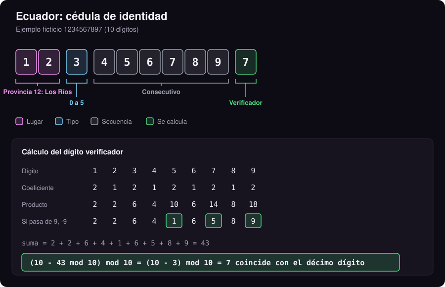
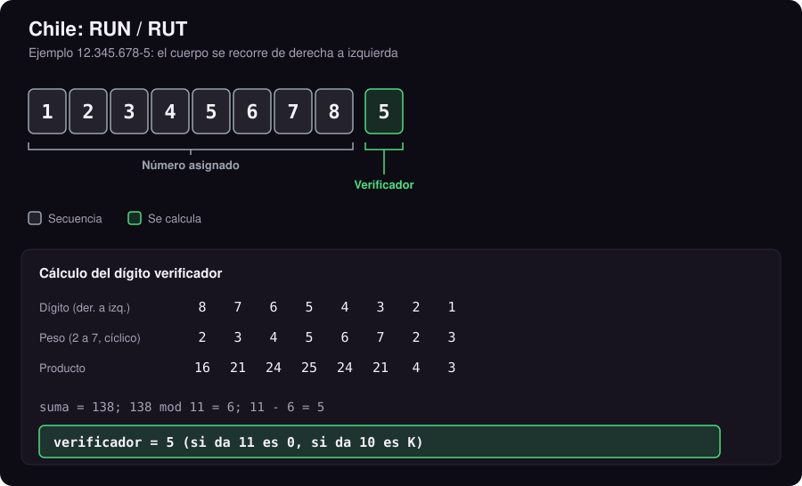
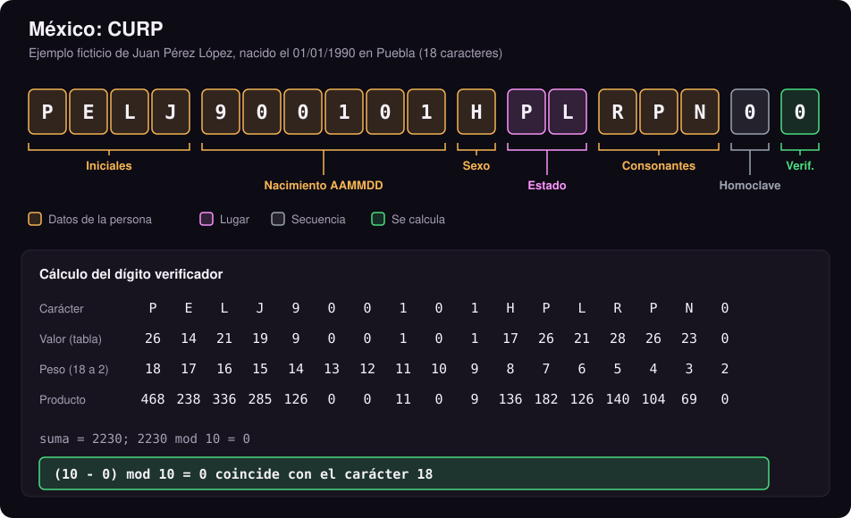
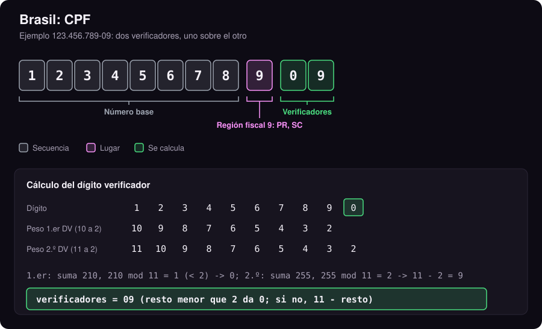
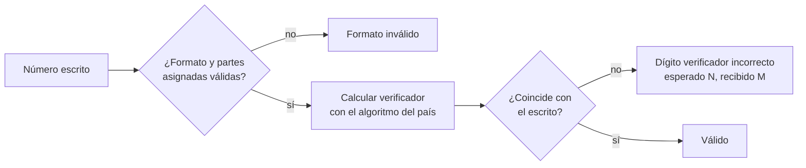
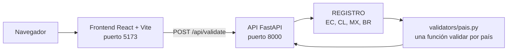

# Verificador de Cédula

Valida documentos de identidad de **Ecuador, Chile, México y Brasil** con su algoritmo oficial de dígito verificador. Es cálculo puro: no consulta bases de datos, no devuelve datos personales y no confirma que una persona exista. Solo responde una pregunta: **¿este número es matemáticamente consistente?**

Demo en vivo (versión ligera, corre en el navegador): https://mino-mateo.github.io/#demo-cedula

> [!NOTE]
> Un número "válido" aquí significa que su estructura y su dígito verificador son correctos. No significa que el documento esté emitido, vigente o que pertenezca a alguien. Es la misma comprobación que hace un formulario antes de enviar los datos: detecta errores de tipeo y números inventados al azar.

## Contenido

- [Cómo leer un número de identidad](#cómo-leer-un-número-de-identidad)
- [Ecuador: cédula](#ecuador-cédula)
- [Chile: RUN y RUT](#chile-run-y-rut)
- [México: CURP](#méxico-curp)
- [Brasil: CPF](#brasil-cpf)
- [Comparación de algoritmos](#comparación-de-algoritmos)
- [Países excluidos y por qué](#países-excluidos-y-por-qué)
- [Arquitectura](#arquitectura)
- [Cómo correrlo](#cómo-correrlo)
- [API](#api)
- [Tests y verificación](#tests-y-verificación)
- [Agregar un país](#agregar-un-país)
- [Uso responsable](#uso-responsable)

## Cómo leer un número de identidad

Casi todos los documentos combinan partes que **se asignan** (dónde, qué tipo, en qué orden) con una parte que **se calcula** a partir de las demás: el dígito verificador. Los diagramas de este README usan siempre los mismos colores:

| Color | Significado | Ejemplos |
|---|---|---|
| Rosa | **Lugar**: provincia, estado o región de emisión | Ecuador `17` = Pichincha, CURP `PL` = Puebla |
| Celeste | **Tipo** de persona o de registro | Tercer dígito de la cédula ecuatoriana |
| Ámbar | **Datos de la persona** codificados en el número | Iniciales y fecha de nacimiento en la CURP |
| Gris | **Secuencia**: número correlativo asignado | Dígitos 4 a 9 de la cédula ecuatoriana |
| Verde | **Dígito verificador**: se calcula, no se asigna | Último dígito en los cuatro países |

Si alguien cambia un dígito por error, el verificador calculado ya no coincide con el escrito, y el número se rechaza.

> [!IMPORTANT]
> Todos los números de ejemplo de este README son **ficticios** o ejemplos clásicos de documentación (`12.345.678-5`, `123.456.789-09`). Nunca uses números reales de personas en issues, tests o capturas.

## Ecuador: cédula

<p align="center"></p>

| Posición | Significado | Regla |
|---|---|---|
| 1 y 2 | **Provincia** donde se inscribió | `01` a `24`, o `30` para ecuatorianos registrados en el exterior |
| 3 | **Tipo** | De `0` a `5` para personas naturales (el `6` y el `9` corresponden al RUC de entidades públicas y sociedades, no a cédulas) |
| 4 a 9 | **Consecutivo** | Número de orden, sin significado propio |
| 10 | **Verificador** | Módulo 10 con coeficientes `2,1,2,1,2,1,2,1,2` |

**Cálculo del verificador**

1. Multiplica los 9 primeros dígitos por `2,1,2,1,2,1,2,1,2`.
2. Si un producto pasa de 9, réstale 9 (equivale a sumar sus cifras: `14` pasa a `1 + 4 = 5`).
3. Suma todo.
4. Verificador = `(10 - suma mod 10) mod 10`. Si la suma ya es múltiplo de 10, el verificador es `0`.

Es el mismo principio que el algoritmo de Luhn de las tarjetas de crédito (ver [Verificador de Tarjeta](https://github.com/Mino-Mateo/Verificador-de-Tarjeta)).

<details>
<summary><strong>Códigos de provincia (01 a 24 y 30)</strong></summary>

| Código | Provincia | Código | Provincia |
|---|---|---|---|
| 01 | Azuay | 13 | Manabí |
| 02 | Bolívar | 14 | Morona Santiago |
| 03 | Cañar | 15 | Napo |
| 04 | Carchi | 16 | Pastaza |
| 05 | Cotopaxi | 17 | Pichincha |
| 06 | Chimborazo | 18 | Tungurahua |
| 07 | El Oro | 19 | Zamora Chinchipe |
| 08 | Esmeraldas | 20 | Galápagos |
| 09 | Guayas | 21 | Sucumbíos |
| 10 | Imbabura | 22 | Orellana |
| 11 | Loja | 23 | Santo Domingo de los Tsáchilas |
| 12 | Los Ríos | 24 | Santa Elena |
| 30 | Ecuatorianos registrados en el exterior | | |

</details>

## Chile: RUN y RUT

<p align="center"></p>

| Parte | Significado | Regla |
|---|---|---|
| Cuerpo (7 u 8 dígitos) | **Número asignado**: el RUN lo da el Registro Civil a las personas y el RUT el SII a las empresas | Correlativo, sin datos de lugar ni fecha |
| Después del guion | **Verificador** | Módulo 11 con pesos `2,3,4,5,6,7` repetidos; puede ser `K` |

**Cálculo del verificador**

1. Recorre el cuerpo **de derecha a izquierda**.
2. Multiplica cada dígito por `2, 3, 4, 5, 6, 7, 2, 3, ...` (la serie vuelve a empezar tras el 7).
3. Suma los productos y calcula `11 - (suma mod 11)`.
4. Si da `11`, el verificador es `0`; si da `10`, es `K`; en otro caso, es ese número.

Los pesos distintos por posición hacen que casi cualquier dígito mal copiado, o dos dígitos vecinos intercambiados, cambien el resultado.

## México: CURP

<p align="center"></p>

La CURP es la única de las cuatro que **codifica datos de la persona**, por eso su verificador cubre 17 caracteres entre letras y números.

| Posición | Significado | Ejemplo (`PELJ900101HPLRPN00`) |
|---|---|---|
| 1 | Primera letra del primer apellido | `P` de **P**érez |
| 2 | Primera vocal interna del primer apellido | `E` de P**e**rez |
| 3 | Primera letra del segundo apellido | `L` de **L**ópez |
| 4 | Primera letra del nombre | `J` de **J**uan |
| 5 a 10 | Fecha de nacimiento `AAMMDD` | `900101` = 1 de enero de 1990 |
| 11 | Sexo | `H` hombre, `M` mujer (RENAPO agregó `X` para personas no binarias; este validador aún no la acepta) |
| 12 y 13 | **Estado** de nacimiento | `PL` = Puebla; `NE` = nacido en el extranjero |
| 14 a 16 | Primera consonante interna de apellidos y nombre | `R` de Pé**r**ez, `P` de Ló**p**ez, `N` de Jua**n** |
| 17 | **Homoclave** (evita duplicados) | Dígito si naciste antes del 2000, letra desde el 2000 |
| 18 | **Verificador** | Suma ponderada módulo 10 |

**Cálculo del verificador**

1. Convierte cada uno de los 17 primeros caracteres a un número con la tabla `0123456789ABCDEFGHIJKLMNÑOPQRSTUVWXYZ`: los dígitos valen lo mismo, `A` vale 10, `N` vale 23, `Ñ` vale 24, `O` vale 25 y así hasta `Z` = 36.
2. Multiplica el carácter 1 por **18**, el 2 por **17**, y así hasta el 17 por **2**.
3. Suma todo. Verificador = `(10 - suma mod 10) mod 10`.

> [!WARNING]
> **Corrección del 2026-09-30.** Hasta esa fecha este repo multiplicaba por pesos 17 a 1 en vez de 18 a 2 y rechazaba CURP reales. Se detectó al contrastar con las CURP publicadas en los tests de [python-stdnum](https://github.com/arthurdejong/python-stdnum): con los pesos corregidos pasan las 14; con los anteriores, solo 2. Los tests ahora incluyen esas 14 CURP de referencia.

Además del verificador, se comprueba que el mes y el día existan y que la clave de estado sea una de las 32 entidades o `NE`. No se revisan las "palabras inconvenientes" que RENAPO reemplaza en las 4 primeras letras (por ejemplo `BACA` se emite como `BXCA`).

<details>
<summary><strong>Claves de estado (RENAPO)</strong></summary>

| Clave | Estado | Clave | Estado | Clave | Estado |
|---|---|---|---|---|---|
| AS | Aguascalientes | GT | Guanajuato | QR | Quintana Roo |
| BC | Baja California | GR | Guerrero | SP | San Luis Potosí |
| BS | Baja California Sur | HG | Hidalgo | SL | Sinaloa |
| CC | Campeche | JC | Jalisco | SR | Sonora |
| CL | Coahuila | MC | Estado de México | TC | Tabasco |
| CM | Colima | MN | Michoacán | TS | Tamaulipas |
| CS | Chiapas | MS | Morelos | TL | Tlaxcala |
| CH | Chihuahua | NT | Nayarit | VZ | Veracruz |
| DF | Ciudad de México | NL | Nuevo León | YN | Yucatán |
| DG | Durango | OC | Oaxaca | ZS | Zacatecas |
| PL | Puebla | QT | Querétaro | NE | Nacido en el extranjero |

</details>

## Brasil: CPF

<p align="center"></p>

| Posición | Significado | Regla |
|---|---|---|
| 1 a 8 | **Número base** | Correlativo |
| 9 | **Región fiscal** que inscribió el CPF | Ver tabla abajo |
| 10 y 11 | **Dos verificadores** | Módulo 11; el segundo incluye al primero |

**Cálculo de los verificadores**

1. **Primero:** multiplica los 9 dígitos por `10, 9, 8, ..., 2`, suma y calcula el resto de dividir por 11. Si el resto es menor que 2, el verificador es `0`; si no, es `11 - resto`.
2. **Segundo:** repite con los 9 dígitos **más el primer verificador**, ahora con pesos `11, 10, ..., 2`.
3. Se rechazan los CPF con los 11 dígitos iguales (`111.111.111-11`): pasan la cuenta, pero la Receita Federal nunca los emite.

Tener dos verificadores encadenados hace que el CPF detecte más errores dobles que un solo dígito de control.

<details>
<summary><strong>Noveno dígito: región fiscal</strong></summary>

| Dígito | Estados | Dígito | Estados |
|---|---|---|---|
| 1 | DF, GO, MS, MT, TO | 6 | MG |
| 2 | AC, AM, AP, PA, RO, RR | 7 | ES, RJ |
| 3 | CE, MA, PI | 8 | SP |
| 4 | AL, PB, PE, RN | 9 | PR, SC |
| 5 | BA, SE | 0 | RS |

</details>

## Comparación de algoritmos

| País | Documento | Largo | Algoritmo | Qué detecta bien |
|---|---|---|---|---|
| Ecuador | Cédula | 10 dígitos | Módulo 10, coeficientes 2 y 1 (tipo Luhn) | Cualquier dígito mal escrito y casi todas las transposiciones de vecinos |
| Chile | RUN / RUT | 7 u 8 dígitos + verificador | Módulo 11, pesos 2 a 7 | Un dígito mal escrito y transposiciones |
| México | CURP | 18 caracteres | Suma ponderada 18 a 2, módulo 10 | Un carácter alterado en cualquier posición |
| Brasil | CPF | 11 dígitos | Doble módulo 11 | Errores simples y buena parte de los dobles |



## Países excluidos y por qué

Solo se agregan documentos con un dígito verificador **oficial y documentado**. Validar solo la longitud daría una falsa sensación de certeza.

- **Colombia:** la cédula de ciudadanía es un número secuencial de la Registraduría, sin dígito verificador. El NIT sí tiene uno, pero es un identificador tributario distinto.
- **Argentina:** el DNI es un número secuencial del RENAPER, sin dígito de control.
- **Perú:** el DNI de 8 dígitos de RENIEC no tiene verificador oficial. Circulan algoritmos de módulo 11 obtenidos por ingeniería inversa, pero RENIEC no los confirma, así que no se incluyen.

## Arquitectura



```
backend/
  main.py                 API: /api/paises y /api/validate
  validators/
    base.py               ResultadoValidacion(valido, mensaje)
    ecuador.py chile.py mexico.py brasil.py
    __init__.py           REGISTRO: código de país -> función
  tests/                  pytest, un archivo por país y uno de la API
frontend/                 React + TypeScript (formulario y resultado)
docs/
  generar-diagramas.py    dibuja los SVG y comprueba cada cálculo
  *.svg                   diagramas de este README
```

## Cómo correrlo

**Backend**

```bash
cd backend
python3 -m venv .venv
source .venv/bin/activate
pip install -r requirements.txt
python -m uvicorn main:app --reload --port 8000
```

**Frontend**

```bash
cd frontend
npm install
npm run dev
```

Abrir `http://localhost:5173`.

## API

`GET /api/paises` devuelve los códigos soportados:

```json
["BR", "CL", "EC", "MX"]
```

`POST /api/validate`:

```bash
curl -s localhost:8000/api/validate -H 'content-type: application/json' \
  -d '{"pais": "EC", "valor": "1234567897"}'
```

```json
{"valido": true, "mensaje": "Cédula válida"}
```

Con un verificador incorrecto el mensaje dice cuál esperaba: `{"valido": false, "mensaje": "Dígito verificador incorrecto (esperado 7, recibido 0)"}`. Un valor vacío o un país no soportado responden `400`.

## Tests y verificación

```bash
cd backend
source .venv/bin/activate
python -m pytest -v
```

Además de los tests unitarios por país:

- **CURP de referencia:** 14 CURP publicadas como válidas en los tests de python-stdnum.
- **Pruebas diferenciales:** el 2026-09-30 se compararon los cuatro validadores contra [python-stdnum](https://github.com/arthurdejong/python-stdnum) con miles de números al azar. Ecuador, Chile y Brasil coinciden en 4.000 de 4.000 casos cada uno; México, en 179 de 180 (la diferencia es una "palabra inconveniente", ver arriba).
- **Diagramas verificados:** `python3 docs/generar-diagramas.py` recalcula cada ejemplo y falla si un verificador no coincide.

## Agregar un país

1. Confirma que el documento tiene un dígito verificador **oficial y documentado**. Si no, agrégalo a [Países excluidos](#países-excluidos-y-por-qué).
2. Crea `backend/validators/<pais>.py` con `validar(valor: str) -> ResultadoValidacion`.
3. Regístralo en `backend/validators/__init__.py` dentro de `REGISTRO`.
4. Agrega tests con números de referencia públicos (nunca de personas reales).

No hace falta tocar el frontend.

## Uso responsable

- Sirve para detectar errores de tipeo, filtrar números inventados y clasificar documentos en investigaciones OSINT, siempre sobre datos que ya tienes de forma legítima.
- No confirma identidad ni titularidad: para eso existen los canales oficiales de cada país (Registro Civil, SII, RENAPO, Receita Federal).
- La CURP contiene fecha de nacimiento, sexo y lugar: trátala como dato personal (en Ecuador aplica la LOPDP; en México, la LFPDPPP).

## Autor

Mateo Miño, Investigador OSINT y Tech Lead en [eCondor Digital](https://econdordigital.org/). Portafolio: https://mino-mateo.github.io
